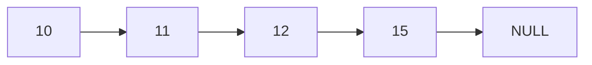
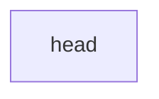
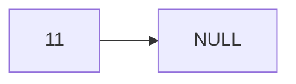
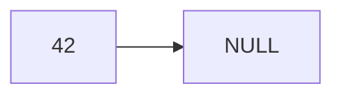
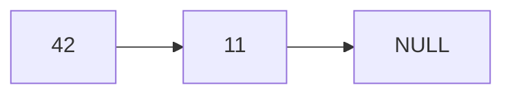
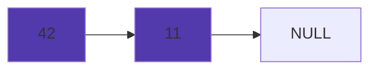
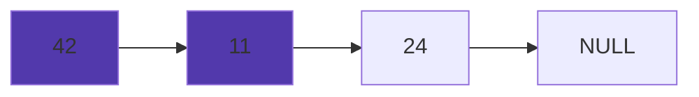

# Linked-list

> A linked-list is a collection of structures ordered by [...] logical links that are stored as part of the data in the structure itself. [...] Every structure has a data field and an address field. The Address field contains the address of its successor.[^1]

## Basic structure 

**Nodes** are linked in a linear structure



**Node** representation in C

```c
typedef struct Node_t node {
  int value;
  struct node *next;
} Node_t;
```

Each element in the linked list will be represented as a **Node struct** that contains an *int* **value** and a ***struct Node_t** pointer* **\*next** that will point to the next node.

## We should be able to : 

1. Create the head of the list
2. Insert 
   1. a new node to the top of the list
   2. a new node at the bottom of the list
   3. a new node at a certain position of the list
3. Print all elements of the linked-list
4. Delete
   1. the last node in the list
   2. the first node in the list
   3. the node at a certain position of the list

## Implementation

### 1. Creation 

We declare the first node to be the head of the list.



### 2. 1 Insertion at the top 

1. We create a new *node* and define it as the head



2. Every new element created will first point at the head address and then becomes the head





## 2.2 Insertion at the bottom

We parse all next values from the list until we reach NULL and then we affect the value of the last next element to the address of the new node







## Implemented

- [x] Create the head of the list
- [ ] Insert
  - [x] a new node to the top of the list
  - [ ] a new node at the bottom of the list
  - [ ] a new node at a certain position of the list
- [x] Print all elements of the linked-list
- [ ] Delete
  - [ ] the last node in the list
  - [ ] the first node in the list
  - [ ] the node at a certain position of the list

## Code implementations

| Language   | Implemented |
| ---------- | ----------- |
| C          |             |
| Java       |             |
| Python     |             |
| Javascript |             |


[^1]: https://en.wikipedia.org/wiki/Linked_data_structure#Linked_lists

