# Linked-list

> A linked-list is a collection of structures ordered by [...] logical links that are stored as part of the data in the structure itself. [...] Every structure has a data field and an address field. The Address field contains the address of its successor.[^1]

## Basic structure 

**Nodes** are linked in a linear structure

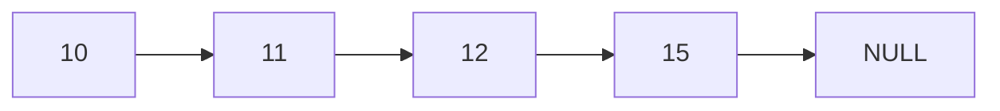

**Node** representation in C

```c
typedef struct Node_t node {
  int value;
  struct node *next;
} Node_t;
```

Each element in the linked list will be represented as a **Node struct** that contains an *int* **value** and a ***struct Node_t** pointer* **\*next** that will point to the next node.

## We should be able to : 

1. Create the head of the list
2. Insert 
   1. a new node to the top of the list
   2. a new node at the bottom of the list
   3. a new node before a certain node value 
   4. a new node after a certain node value
3. Print all elements of the linked-list
4. Delete
   1. the last node in the list
   2. the first node in the list
   3. at a certain node value

## Implementation

### 1. Creation 

We declare the first node to be the head of the list.


### 2. 1 Insertion at the top 

1. We create a new *node* and define it as the head

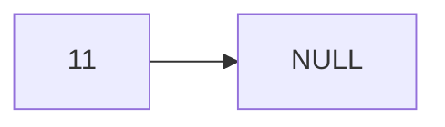

2. Every new element created will first point at the head address and then becomes the head

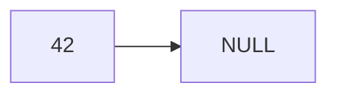

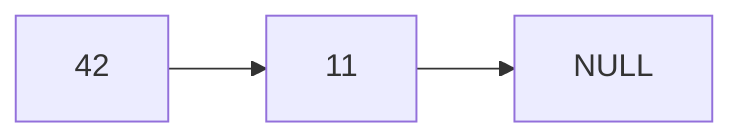

### 2.2 Insertion at the bottom

We parse all next values from the list until we reach NULL and then we affect the value of the last next element to the address of the new node


### 2.3 Insertion before a certain node value

We want to insert node 99 before node 24.


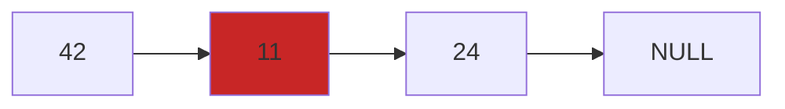

First we must get the address of the <span style="color:#c82626">predecessor (11)</span> of the <span style="color:#169b1f">node (24)</span> where we want to make insertion. 

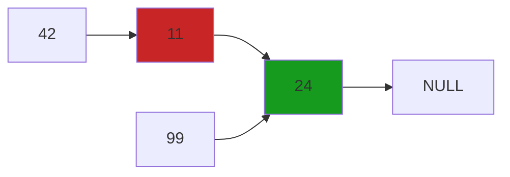

Then we assign the next pointer value of the new node (99) to the <span style="color:#c82626">next pointer value of the predecessor (11)</span>. 

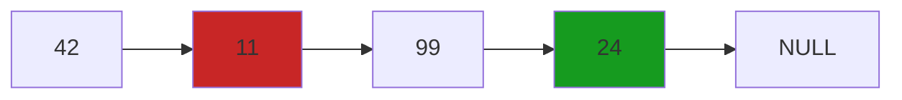

Finally the <span style="color:#c82626">next pointer from predecessor (11)</span> points to the address of the new node (99). 

### 2.4 Insertion after a certain node value

We want to insert node 101 after node 99

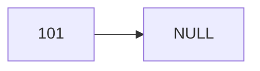

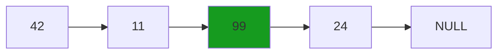

First we get the address of the <span style="color:#169b1f">node 99</span> where we want to make insertion after. 

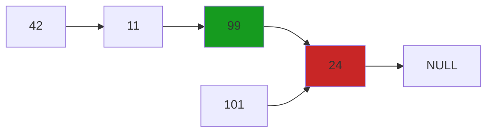

Then we assign the <span style="color:#c82626">next pointer</span> value of the <span style="color:#169b1f">node 99 </span>to the next pointer value of the new node 101. 

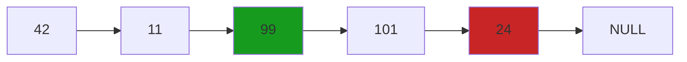


Finally the <span style="color:#169b1f">next pointer of the node 99</span> needs to point to the address of the new node 101. 

### 3. Print all elements

We parse all next values from the list until we reach NULL while printing every node values.

### 4.1 Delete the last node

We parse all next node values of each next element until we reach NULL. So we can identify the last node <span style="color:#169b1f">predecessor</span>.


We can then free the <span style="color:#c82626">last node</span> and set the <span style="color:#169b1f">predecessor</span> next pointer value to NULL.

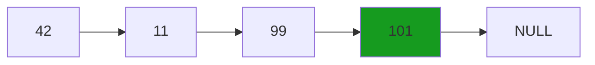

### 4.2 Delete the first node (head of list)

We simply set the <span style="color:#169b1f">next node of the head</span> to be the <u>new head</u>.

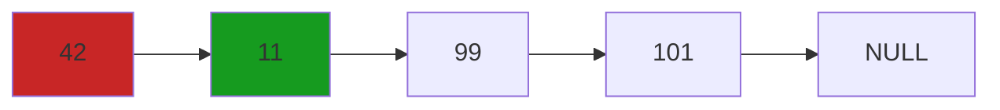

And then we can free the <span style="color:#c82626">first node</span> in the list

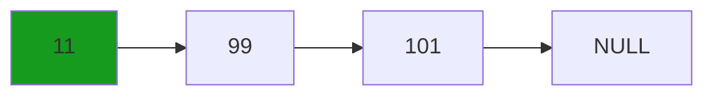

### 4.3 Delete at a certain node value

We get the <span style="color:#c82626">node (99)</span> to be deleted

```mermaid
flowchart LR
	11 --> 99
	99:::del --> 101
	101 --> NULL
	classDef current fill:#169b1f;
	classDef del fill:#c82626;
	classDef someclass fill:#5239ac;
```

We get its <span style="color:#169b1f">predecessor</span> 

```mermaid
flowchart LR
	11:::current --> 99
	99:::del --> 101
	101 --> NULL
	classDef current fill:#169b1f;
	classDef del fill:#c82626;
	classDef someclass fill:#5239ac;
```

And make its <span style="color:#169b1f">next node  value</span> to point to the next node value of <span style="color:#c82626">99</span>


```mermaid
flowchart LR
	11:::current --> 101
	99:::del --> 101
	101 --> NULL
	classDef current fill:#169b1f;
	classDef del fill:#c82626;
	classDef someclass fill:#5239ac;
```

We finally free the <span style="color:#c82626">node (99)</span> from the list

```mermaid
flowchart LR
	11:::current --> 101
	101 --> NULL
	classDef current fill:#169b1f;
```


## Implemented

- [x] Create the head of the list
- [x] Insert
  - [x] a new node to the top of the list
  - [x] a new node at the bottom of the list
  - [x] a new node before a certain node value 
  - [x] a new node after a certain node value 
- [x] Print all elements of the linked-list
- [x] Delete
  - [x] the last node in the list
  - [x] the first node in the list
  - [x] the node at a certain node value 

## Code implementations

| Language   | Implemented |
| ---------- | ----------- |
| C          |             |
| Java       |             |
| Python     |             |
| Javascript |             |


[^1]: https://en.wikipedia.org/wiki/Linked_data_structure#Linked_lists

